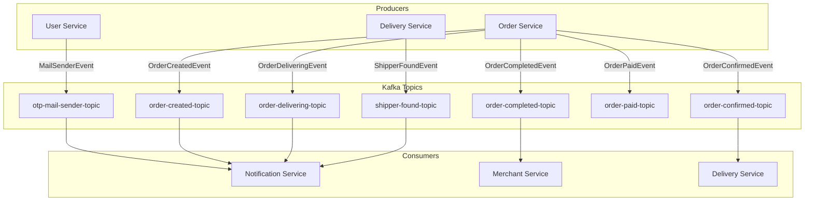
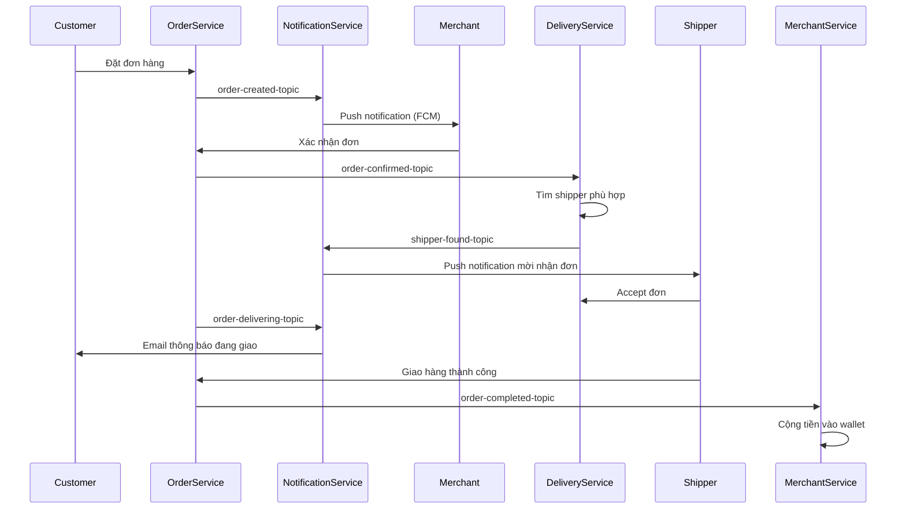

# 📬 Kafka Event Flows Documentation

Tài liệu này mô tả chi tiết các luồng event được truyền qua Apache Kafka trong hệ thống **Food Ordering Application**.

---

## 📋 Tổng quan

Hệ thống sử dụng **Apache Kafka** để xử lý giao tiếp bất đồng bộ (asynchronous) giữa các microservices. Kiến trúc event-driven này giúp:

- **Giảm coupling** giữa các services
- **Tăng khả năng mở rộng** (scalability)
- **Đảm bảo độ tin cậy** trong xử lý message

---

## 🗺️ Sơ đồ tổng quan Event Flow



---

## 📬 Chi tiết các Kafka Topics

### 1. `otp-mail-sender-topic`

| Thuộc tính | Giá trị |
|------------|---------|
| **Producer** | `user-service` |
| **Consumer** | `notification-service` |
| **Group ID** | `notification-service-group` |
| **Mục đích** | Gửi email OTP cho xác thực người dùng |

#### Event: `MailSenderEvent`

```java
public record MailSenderEvent(
    String recipientEmail,  // Email người nhận
    String subject,         // Tiêu đề email
    String otpCode,         // Mã OTP
    String eventType        // Loại event: "REGISTER" | "FORGOT_PASSWORD"
) {}
```

#### Flow:
```
User đăng ký/quên mật khẩu
    → user-service tạo OTP
    → Bắn event đến Kafka
    → notification-service nhận và gửi email
```

---

### 2. `order-created-topic`

| Thuộc tính | Giá trị |
|------------|---------|
| **Producer** | `order-service` |
| **Consumer** | `notification-service` |
| **Group ID** | `notification-service-group` |
| **Mục đích** | Thông báo cho merchant có đơn hàng mới |

#### Event: `OrderCreatedEvent`

```java
public record OrderCreatedEvent(
    Long orderId,           // ID đơn hàng
    Long merchantId,        // ID quán
    String merchantName,    // Tên quán
    String customerName,    // Tên khách hàng
    BigDecimal grandTotal,  // Tổng tiền
    LocalDateTime createdAt,// Thời gian tạo
    List<String> itemNames  // Danh sách món
) {}
```

#### Flow:
```
Khách hàng đặt đơn
    → order-service tạo đơn hàng
    → Bắn event đến Kafka
    → notification-service gửi FCM notification đến merchant app
```

---

### 3. `order-confirmed-topic`

| Thuộc tính | Giá trị |
|------------|---------|
| **Producer** | `order-service` |
| **Consumer** | `delivery-service` |
| **Group ID** | `delivery-service-group` |
| **Mục đích** | Yêu cầu tìm shipper cho đơn hàng |

#### Event: `OrderConfirmedEvent`

```java
public record OrderConfirmedEvent(
    Long orderId,              // ID đơn hàng
    Long merchantId,           // ID quán
    String customerName,       // Tên khách
    String customerPhone,      // SĐT khách
    String deliveryAddress,    // Địa chỉ giao
    BigDecimal productPrice,   // Giá sản phẩm
    BigDecimal shippingFee,    // Phí ship
    Double merchantLatitude,   // Vĩ độ quán
    Double merchantLongitude   // Kinh độ quán
) {}
```

#### Flow:
```
Merchant xác nhận đơn hàng
    → order-service bắn event
    → delivery-service nhận và bắt đầu tìm shipper phù hợp
```

---

### 4. `order-delivering-topic`

| Thuộc tính | Giá trị |
|------------|---------|
| **Producer** | `order-service` |
| **Consumer** | `notification-service` |
| **Group ID** | `notification-service-group` |
| **Mục đích** | Thông báo cho khách hàng đơn đang được giao |

#### Event: `OrderDeliveringEvent`

```java
public record OrderDeliveringEvent(
    Long orderId,            // ID đơn hàng
    String customerName,     // Tên khách
    String customerEmail,    // Email khách
    String deliveryAddress,  // Địa chỉ giao
    String merchantName,     // Tên quán
    String descriptionOrder, // Mô tả đơn
    List<String> productName,// Danh sách món
    BigDecimal productPrice, // Giá sản phẩm
    BigDecimal shippingFee   // Phí ship
) {}
```

#### Flow:
```
Shipper bắt đầu giao hàng
    → order-service cập nhật trạng thái
    → Bắn event đến Kafka
    → notification-service gửi email thông báo cho khách
```

---

### 5. `order-completed-topic`

| Thuộc tính | Giá trị |
|------------|---------|
| **Producer** | `order-service` |
| **Consumer** | `merchant-service` |
| **Group ID** | `merchant-service-group` |
| **Mục đích** | Cộng tiền vào ví của merchant khi đơn hoàn thành |

#### Event: `OrderCompletedEvent`

```java
public record OrderCompletedEvent(
    Long orderId,          // ID đơn hàng
    Long merchantId,       // ID quán
    BigDecimal orderAmount // Số tiền đơn hàng
) {}
```

#### Flow:
```
Đơn hàng giao thành công
    → order-service bắn event hoàn thành
    → merchant-service nhận event
    → Cộng tiền vào wallet của merchant
    → Tạo transaction history
```

---

### 6. `order-paid-topic`

| Thuộc tính | Giá trị |
|------------|---------|
| **Producer** | `order-service` |
| **Consumer** | `notification-service` |
| **Group ID** | `notification-group` |
| **Mục đích** | Thông báo thanh toán thành công cho merchant |

#### Event: `OrderPaidEvent`

```java
public class OrderPaidEvent {
    Long orderId;         // ID đơn hàng
    Long merchantId;      // ID quán
    Long ownerId;         // ID chủ quán
    BigDecimal amount;    // Số tiền
    String paymentMethod; // Phương thức: "ZALOPAY"
    LocalDateTime paidAt; // Thời gian thanh toán
}
```

#### Flow:
```
Khách thanh toán qua ZaloPay thành công
    → order-service bắn event
    → notification-service nhận event
    → Gửi FCM notification đến merchant app về việc đã nhận thanh toán
```

---

### 7. `shipper-found-topic`

| Thuộc tính | Giá trị |
|------------|---------|
| **Producer** | `delivery-service` |
| **Consumer** | `notification-service` |
| **Group ID** | `notification-group` |
| **Mục đích** | Mời shipper nhận đơn hàng |

#### Event: `ShipperFoundEvent`

```java
public record ShipperFoundEvent(
    Long shipperId,       // ID shipper
    Long orderId,         // ID đơn hàng
    String pickupAddress, // Địa chỉ lấy hàng
    Double lat,           // Vĩ độ
    Double lon,           // Kinh độ
    BigDecimal shippingFee// Phí ship
) {}
```

#### Flow:
```
delivery-service tìm được shipper phù hợp
    → Bắn event mời nhận đơn
    → notification-service gửi FCM đến shipper app
    → Shipper nhận thông báo và có thể accept đơn
```

---

## 🔄 Luồng hoạt động tổng thể của đơn hàng



---

## 🏗️ Cấu trúc thư mục Kafka

```
📦 food-ordering-backend
├── 📂 user-service
│   └── 📂 kafka
│       ├── KafkaProducerService.java   # Producer gửi OTP
│       └── 📂 events
│           └── MailSenderEvent.java
│
├── 📂 order-service
│   └── 📂 kafka
│       ├── KafkaProducerService.java   # Producer cho order events
│       └── 📂 events
│           ├── OrderCreatedEvent.java
│           ├── OrderConfirmedEvent.java
│           ├── OrderDeliveringEvent.java
│           └── OrderCompletedEvent.java
│
├── 📂 delivery-service
│   └── 📂 kafka
│       ├── KafkaProducerService.java   # Producer shipper-found
│       ├── KafkaConsumerService.java   # Consumer order-confirmed
│       └── 📂 events
│           ├── OrderConfirmedEvent.java
│           └── ShipperFoundEvent.java
│
├── 📂 notification-service
│   └── 📂 consumer
│       └── NotificationConsumer.java   # Consumer nhiều topics
│
└── 📂 merchant-service
    └── 📂 kafka
        └── WalletConsumer.java         # Consumer order-completed
```

---

## ⚙️ Cấu hình Kafka

### application.yaml (ví dụ từ order-service)

```yaml
spring:
  kafka:
    bootstrap-servers: ${KAFKA_BOOTSTRAP_SERVERS}
    producer:
      key-serializer: org.apache.kafka.common.serialization.StringSerializer
      value-serializer: org.springframework.kafka.support.serializer.JsonSerializer
    consumer:
      group-id: order-service-group
      auto-offset-reset: earliest
      key-deserializer: org.apache.kafka.common.serialization.StringDeserializer
      value-deserializer: org.springframework.kafka.support.serializer.JsonDeserializer
      properties:
        spring.json.trusted.packages: "*"
```

---

## 📝 Bảng tóm tắt

| Topic | Producer | Consumer | Mục đích |
|-------|----------|----------|----------|
| `otp-mail-sender-topic` | user-service | notification-service | Gửi email OTP |
| `order-created-topic` | order-service | notification-service | Thông báo đơn mới cho merchant |
| `order-confirmed-topic` | order-service | delivery-service | Yêu cầu tìm shipper |
| `order-delivering-topic` | order-service | notification-service | Thông báo đang giao cho khách |
| `order-completed-topic` | order-service | merchant-service | Cộng tiền vào wallet merchant |
| `order-paid-topic` | order-service | notification-service | Thông báo thanh toán cho merchant |
| `shipper-found-topic` | delivery-service | notification-service | Mời shipper nhận đơn |

---

## 🚀 Hướng dẫn debug Kafka

### Xem logs của Kafka
```bash
docker logs fo-kafka -f
```

### Kiểm tra topics
```bash
docker exec -it fo-kafka kafka-topics --bootstrap-server localhost:9092 --list
```

### Xem messages trong topic
```bash
docker exec -it fo-kafka kafka-console-consumer \
    --bootstrap-server localhost:9092 \
    --topic order-created-topic \
    --from-beginning
```

---

*Cập nhật lần cuối: Tháng 01/2026*
