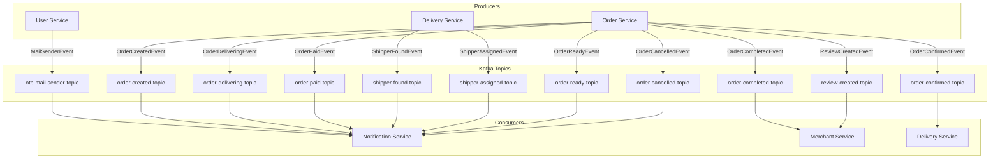

# 📬 Kafka Event Flows Documentation

Tài liệu này mô tả chi tiết các luồng event được truyền qua Apache Kafka trong hệ thống **Food Ordering Application**.

---

## 📋 Tổng quan

Hệ thống sử dụng **Apache Kafka** để xử lý giao tiếp bất đồng bộ (asynchronous) giữa các microservices. Kiến trúc event-driven này giúp:

- **Giảm coupling** giữa các services
- **Tăng khả năng mở rộng** (scalability)
- **Đảm bảo độ tin cậy** trong xử lý message

---

## 🗺️ Sơ đồ tổng quan Event Flow



---

## 📬 Chi tiết các Kafka Topics

### 1. `otp-mail-sender-topic`

| Thuộc tính | Giá trị |
|------------|---------|
| **Producer** | `user-service` |
| **Consumer** | `notification-service` |
| **Mục đích** | Gửi email OTP cho xác thực người dùng |

Event Data (`MailSenderEvent`):
```java
{
    "recipientEmail": "user@example.com",
    "subject": "OTP Code",
    "otpCode": "123456",
    "eventType": "REGISTER" | "FORGOT_PASSWORD"
}
```

### 2. `order-created-topic`

| Thuộc tính | Giá trị |
|------------|---------|
| **Producer** | `order-service` |
| **Consumer** | `notification-service` |
| **Mục đích** | Thông báo cho merchant có đơn hàng mới (Push Notification) |

Event Data (`OrderCreatedEvent`):
```java
{
    "orderId": 101,
    "merchantId": 1,
    "merchantName": "Burger King",
    "customerName": "John Doe",
    "grandTotal": 150000,
    "createdAt": "2026-01-20T10:00:00",
    "itemNames": ["2x Burger", "1x Coke"]
}
```

### 3. `order-confirmed-topic`

| Thuộc tính | Giá trị |
|------------|---------|
| **Producer** | `order-service` |
| **Consumer** | `delivery-service` |
| **Mục đích** | Trigger quy trình tìm shipper sau khi quán xác nhận đơn |

Event Data (`OrderConfirmedEvent`):
```java
{
    "orderId": 101,
    "merchantId": 1,
    "customerName": "John Doe",
    "customerPhone": "0987654321",
    "deliveryAddress": "123 ABC Street",
    "productPrice": 120000,
    "shippingFee": 30000,
    "merchantLatitude": 10.762622,
    "merchantLongitude": 106.660172
}
```

### 4. `shipper-found-topic`

| Thuộc tính | Giá trị |
|------------|---------|
| **Producer** | `delivery-service` |
| **Consumer** | `notification-service` |
| **Mục đích** | Gửi thông báo mời Shipper nhận đơn (khi hệ thống tìm thấy shipper phù hợp) |

Event Data (`ShipperFoundEvent`):
```java
{
    "shipperId": 505,
    "orderId": 101,
    "pickupAddress": "Burger King, Quan 1",
    "lat": 10.762622,
    "lon": 106.660172,
    "shippingFee": 30000
}
```

### 5. `shipper-assigned-topic`

| Thuộc tính | Giá trị |
|------------|---------|
| **Producer** | `delivery-service` |
| **Consumer** | `notification-service` |
| **Mục đích** | Thông báo cho Khách hàng: "Đã có tài xế nhận đơn" |

Event Data (`ShipperAssignedEvent`):
```java
{
    "orderId": 101,
    "shipperId": 505,
    "shipperName": "Nguyen Van Shipper",
    "shipperPhone": "0909000111",
    "licensePlate": "59UA-123.45"
}
```

### 6. `order-ready-topic`

| Thuộc tính | Giá trị |
|------------|---------|
| **Producer** | `order-service` |
| **Consumer** | `notification-service` |
| **Mục đích** | Thông báo cho Shipper: "Món đã xong, vào lấy ngay!" |

Event Data (`OrderReadyEvent`):
```java
{
    "orderId": 101,
    "merchantId": 1,
    "shipperId": 505
}
```

### 7. `order-delivering-topic`

| Thuộc tính | Giá trị |
|------------|---------|
| **Producer** | `order-service` |
| **Consumer** | `notification-service` |
| **Mục đích** | Thông báo cho Khách hàng: "Shipper đã lấy món và đang giao" |

Event Data (`OrderDeliveringEvent`):
```java
{
    "orderId": 101,
    "customerName": "John Doe",
    "customerEmail": "john@email.com",
    "deliveryAddress": "123 ABC Street",
    "merchantName": "Burger King",
    "descriptionOrder": "Giao nhanh giup em",
    "productName": ["Burger", "Coke"],
    "productPrice": 120000,
    "shippingFee": 30000
}
```

### 8. `order-completed-topic`

| Thuộc tính | Giá trị |
|------------|---------|
| **Producer** | `order-service` |
| **Consumer** | `merchant-service` |
| **Mục đích** | Chuyển tiền doanh thu vào Ví Merchant sau khi hoàn thành đơn |

Event Data (`OrderCompletedEvent`):
```java
{
    "orderId": 101,
    "merchantId": 1,
    "orderAmount": 150000
}
```

### 9. `order-paid-topic`

| Thuộc tính | Giá trị |
|------------|---------|
| **Producer** | `order-service` |
| **Consumer** | `notification-service` |
| **Mục đích** | Thông báo Merchant khi Khách thanh toán Online (ZaloPay) thành công |

Event Data (`OrderPaidEvent`):
```java
{
    "orderId": 101,
    "merchantId": 1,
    "ownerId": 10,
    "amount": 150000,
    "paymentMethod": "ZALOPAY",
    "paidAt": "2026-01-20T10:05:00"
}
```

### 10. `order-cancelled-topic`

| Thuộc tính | Giá trị |
|------------|---------|
| **Producer** | `order-service` |
| **Consumer** | `notification-service` |
| **Mục đích** | Thông báo Hủy đơn (Báo Merchant nếu khách hủy, báo Khách nếu Merchant hủy) |

Event Data (`OrderCancelledEvent`):
```java
{
    "orderId": 101,
    "merchantId": 1,
    "userId": 202, // User thực hiện hủy
    "cancelledBy": "CUSTOMER" | "MERCHANT",
    "reason": "Doi qua lau",
    "amount": 150000,
    "paymentMethod": "ZALOPAY",
    "cancelledAt": "2026-01-20T10:30:00"
}
```

### 11. `review-created-topic`

| Thuộc tính | Giá trị |
|------------|---------|
| **Producer** | `order-service` |
| **Consumer** | `merchant-service` |
| **Mục đích** | Cập nhật điểm Rating trung bình của Quán khi có đánh giá mới |

Event Data (`ReviewCreatedEvent`):
```java
{
    "merchantId": 1,
    "rating": 4.5
}
```

---

## 📝 Bảng tóm tắt Routing

| Topic | Producer | Consumer | Hành động chính |
|-------|----------|----------|-----------------|
| `otp-mail-sender-topic` | user-service | notification-service | Gửi Email OTP |
| `order-created-topic` | order-service | notification-service | Push Noti Merchant (Đơn mới) |
| `order-confirmed-topic` | order-service | delivery-service | Tìm kiếm Shipper (Redis) |
| `shipper-found-topic` | delivery-service | notification-service | Push Noti Shipper (Mời đơn) |
| `shipper-assigned-topic`| delivery-service | notification-service | Push Noti Customer (Có xe) |
| `order-ready-topic` | order-service | notification-service | Push Noti Shipper (Món xong) |
| `order-delivering-topic`| order-service | notification-service | Email Customer (Đang giao) |
| `order-completed-topic` | order-service | merchant-service | Cộng tiền Ví Merchant |
| `order-paid-topic` | order-service | notification-service | Push Noti Merchant (Tiền về) |
| `order-cancelled-topic` | order-service | notification-service | Push Noti Hủy đơn |
| `review-created-topic` | order-service | merchant-service | Tính lại Rating Quán |

---
*Documented by Antigravity - 2026*
