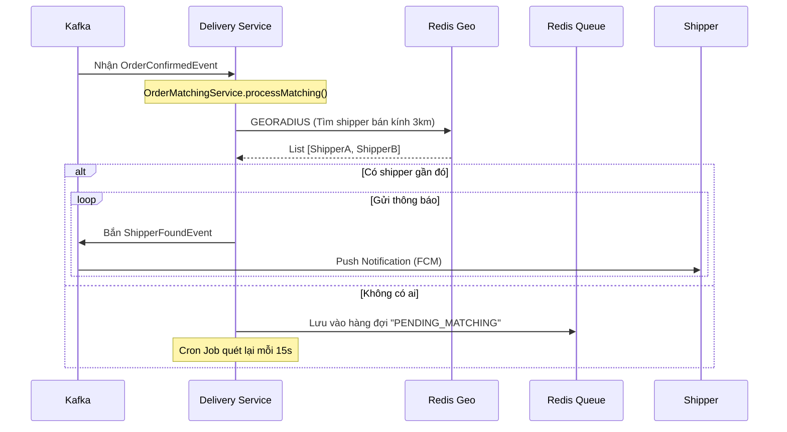

# 🍔 Food Ordering Backend - Luồng Hoạt Động Hệ Thống

Tài liệu này mô tả chi tiết luồng hoạt động của code trong hệ thống **Food Ordering Backend**, giúp bạn hiểu cách các microservices giao tiếp, xử lý logic nghiệp vụ và luồng dữ liệu.

---

## 📋 Mục lục

1. [Tổng quan kiến trúc & Cổng](#tổng-quan-kiến-trúc--cổng)
2. [Luồng xác thực (Authentication Flow)](#luồng-xác-thực-authentication-flow)
3. [Luồng đặt hàng & Tính phí (Order Flow)](#luồng-đặt-hàng--tính-phí-order-flow)
4. [Luồng thanh toán (Payment Flow)](#luồng-thanh-toán-payment-flow)
5. [Luồng tìm shipper (Delivery Matching Flow)](#luồng-tìm-shipper-delivery-matching-flow)
6. [Luồng giao hàng & Ví Shipper (Delivery Flow)](#luồng-giao-hàng--ví-shipper-delivery-flow)
7. [Luồng thông báo (Notification Flow)](#luồng-thông-báo-notification-flow)
8. [Chi tiết từng Microservice](#chi-tiết-từng-microservice)

---

## 🏗️ Tổng quan kiến trúc & Cổng

### Mô hình Microservices

```
┌─────────────────────────────────────────────────────────────────────────────────────┐
│                                    CLIENT                                            │
│                        (Mobile App / Web App / Postman)                              │
└─────────────────────────────────────────────────────────────────────────────────────┘
                                         │
                                         ▼
┌─────────────────────────────────────────────────────────────────────────────────────┐
│                              NGROK TUNNEL (Public URL)                               │
│                              https://your-domain.ngrok-free.app                      │
└─────────────────────────────────────────────────────────────────────────────────────┘
                                         │
                                         ▼
┌─────────────────────────────────────────────────────────────────────────────────────┐
│                             API GATEWAY (:8080)                                      │
│  ┌──────────────────────────────────────────────────────────────────────────────┐   │
│  │  AuthCookieToHeaderFilter                                                     │   │
│  │  - Đọc Cookie (access_token, refresh_token)                                   │   │
│  │  - Chuyển Token vào Header Authorization                                      │   │
│  │  - Route request tới Service phù hợp qua Eureka                               │   │
│  │  - Rate Limiting (Redis)                                                      │   │
│  └──────────────────────────────────────────────────────────────────────────────┘   │
└─────────────────────────────────────────────────────────────────────────────────────┘
                                         │
            ┌────────────┬───────────────┼───────────────┬────────────┐
            ▼            ▼               ▼               ▼            ▼
     ┌──────────┐  ┌──────────┐   ┌──────────┐   ┌──────────┐  ┌──────────┐
     │   USER   │  │ MERCHANT │   │  ORDER   │   │ DELIVERY │  │ PAYMENT  │
     │ SERVICE  │  │ SERVICE  │   │ SERVICE  │   │ SERVICE  │  │ SERVICE  │
     │  (:8081) │  │  (:8083) │   │  (:8084) │   │  (:8085) │  │  (:8086) │
     └──────────┘  └──────────┘   └──────────┘   └──────────┘  └──────────┘
            │            │               │               │            │
            └────────────┴───────────────┴───────────────┴────────────┘
                                         │
                         ┌───────────────┼───────────────┐
                         ▼               ▼               ▼
                   ┌──────────┐   ┌──────────┐   ┌──────────┐
                   │  KAFKA   │   │  MySQL   │   │  REDIS   │
                   │  (:9092) │   │  (:3306) │   │  (:6379) │
                   └──────────┘   └──────────┘   └──────────┘
                         │
                         ▼
                   ┌──────────────────┐
                   │   NOTIFICATION   │
                   │     SERVICE      │
                   │     (:8082)      │
                   └──────────────────┘
```

> **Lưu ý:** Cấu hình cổng được định nghĩa trong file `.env` và `docker-compose.yaml`.

---

## 🔐 Luồng xác thực (Authentication Flow)

### 1. Đăng ký tài khoản (Register Flow)

**Step 1: Client yêu cầu đăng ký**
- **API**: `POST /api/v1/auth/register/customer` (User Service)
- **Logic**:
  1. Validate email/username.
  2. Tạo `PendingUser` (chưa kích hoạt).
  3. Tạo mã OTP (6 số), lưu Redis (TTL 5 phút).
  4. Bắn Kafka event `otp-mail-sender-topic`.
- **Kafka Consumer**: Notification Service nhận event → Gửi Email OTP.

**Step 2: Client xác thực OTP**
- **API**: `POST /api/v1/auth/verify-registration`
- **Logic**:
  1. Check OTP từ Redis.
  2. Nếu đúng: Chuyển `PendingUser` → `User` (Active).
  3. Xóa OTP.

### 2. Đăng nhập (Login Flow)

**API**: `POST /api/v1/auth/login`
- **Logic**:
  1. Verify username/password.
  2. Tạo **Access Token** (JWT, ngắn hạn) và **Refresh Token** (dài hạn).
  3. Lưu Refresh Token vào Redis (White-list).
  4. Trả về **HttpOnly Cookies**.
- **Tại sao dùng Cookie?**: Bảo mật hơn LocalStorage, tránh XSS lấy trộm token. Gateway sẽ tự động chuyển Cookie thành Header `Authorization: Bearer ...` trước khi gọi các microservice khác.

---

## 🛒 Luồng đặt hàng & Tính phí (Order Flow)

### 1. Tạo đơn hàng (Create Order)

Hệ thống tính toán phí ship ngay lập tức dựa trên tọa độ.

```java
// Logic trong CustomerOrderService.createOrder()
public OrderResponse createOrder(Long userId, OrderRequest request) {
    // 1. Gọi Feign sang Merchant Service lấy thông tin quán
    RestaurantDTO restaurant = getClientDTO.getRestaurantDTO(request.merchantId());
    
    // 2. Validate: Quán bắt buộc phải có tọa độ
    if (restaurant.latitude() == null || restaurant.longitude() == null) {
        throw new OrderException(OrderErrorCode.MERCHANT_COORDINATES_MISSING);
    }

    // 3. Tính khoảng cách (DistanceCalculator)
    double distance = distanceCalculator.calculateEstimatedDistance(
            restaurant.latitude(), restaurant.longitude(),       // Tọa độ quán
            request.deliveryLatitude(), request.deliveryLongitude() // Tọa độ khách
    );

    // 4. Tính phí ship
    BigDecimal shippingFee = distanceCalculator.calculateShippingFee(distance);
    
    // 5. Snapshot dữ liệu (Lưu cứng thông tin quán và giá tại thời điểm đặt)
    Order order = Order.builder()
            .merchantName(restaurant.name())
            .merchantLatitude(restaurant.latitude())
            .merchantLongitude(restaurant.longitude())
            .shippingFee(shippingFee)
            .distanceKm(distance)
            .orderStatus(OrderStatus.CREATED) // Mặc định là CREATED
            .build();
    
    // 6. Lưu DB và bắn Event
    orderRepository.save(order);
    kafkaProducerService.sendOrderCreatedEvent(...);
}
```

### 2. Merchant xác nhận (Confirm & Cook)

Merchant có thể nhận đơn COD (CREATED) hoặc đơn ZaloPay đã trả (PAID).

**API**: `PUT /api/v1/management/order/merchant/{id}/confirm`
- **Logic**:
  1. Check quyền sở hữu quán.
  2. Chấp nhận status: `CREATED` hoặc `PAID`.
  3. Chuyển status → `PREPARING`.
  4. Bắn Kafka `OrderConfirmedEvent` → **Đây là tín hiệu để bắt đầu tìm Shipper!**

**API**: `PUT /api/v1/management/order/merchant/{id}/ready`
- **Logic**:
  1. Chuyển status `PREPARING` → `READY`.
  2. (Món ăn đã nấu xong, shipper đến là lấy được ngay).

---

## 💳 Luồng thanh toán (Payment Flow)

Tích hợp ZaloPay Sandbox.

1. **Client tạo thanh toán**:
   - `POST /api/v1/payment/zalopay/create`
   - Payment Service gọi ZaloPay API lấy `order_url`.
   - Client nhận URL và mở app ZaloPay/Quét QR.

2. **ZaloPay Callback (Webhook)**:
   - ZaloPay gọi ngược về `POST /api/v1/payment/callback`.
   - Payment Service verify **HMAC Signature** (để đảm bảo không bị giả mạo).
   - Nếu hợp lệ: Gọi Internal API sang Order Service.
   - Order Service update status: `CREATED` → `PAID`.
   - Bắn Kafka `OrderPaidEvent` → Báo Merchant "Tiền đã về!".

---

## 🔍 Luồng tìm shipper (Delivery Matching Flow)

Service: **Delivery Service** sử dụng **Redis GEO** để tìm kiếm không gian.



---

## 🚚 Luồng giao hàng & Ví Shipper (Delivery Flow)

Quy trình shipper xử lý đơn và nhận tiền công.

### 1. Shipper nhận đơn (Accept)
- **API**: `POST /api/v1/delivery/shippers/accept`
- **Logic**:
  1. Check concurrency (tranh chấp đơn): Dùng DB Lock hoặc check `existsByOrderId`.
  2. Tạo bản ghi `Delivery` với status `ACCEPTED`.
  3. Xóa đơn khỏi hàng đợi tìm kiếm (để shipper khác không thấy nữa).

### 2. Lấy hàng (Pick Up)
- **API**: `POST /api/v1/delivery/shippers/picked-up`
- **Logic**:
  1. Update Delivery status → `DELIVERING`.
  2. Gọi Order Service update Order status → `DELIVERING`.
  3. Bắn Kafka báo khách "Hàng đang đến!".

### 3. Hoàn thành & Cộng tiền (Complete)
- **API**: `POST /api/v1/delivery/shippers/complete`
- **Logic Quan Trọng**:
  1. Update Delivery status → `COMPLETED`.
  2. Gọi Order Service update Order status → `COMPLETED` (Hoàn tất vòng đời đơn hàng).
  3. **Cộng tiền Ví Shipper**:
     - Lấy `shippingFee` từ đơn hàng.
     - Tìm/Tạo `ShipperWallet`.
     - `wallet.balance += shippingFee`.
     - Lưu lịch sử `ShipperTransaction` (Type: INCOME).

```java
// DeliveryService.completeOrder()
public void completeOrder(Long userId, Long orderId) {
    // ... Update status ...

    // Tính toán thu nhập
    BigDecimal shippingFee = orderRes.shippingFee();
    
    // Cộng ví
    ShipperWallet wallet = walletRepository.findByShipper_Id(shipperId);
    wallet.setBalance(wallet.getBalance().add(shippingFee));
    walletRepository.save(wallet);

    // Lưu log giao dịch
    transactionRepository.save(ShipperTransaction.builder()
            .amount(shippingFee)
            .type(TransactionType.INCOME)
            .description("Thu nhập đơn " + orderId)
            .build());
}
```

---

## 📢 Luồng thông báo (Notification Flow)

Notification Service là **Central Hub** nhận sự kiện từ khắp nơi.

| Sự kiện (Kafka Topic) | Nguồn phát | Hành động |
|-----------------------|------------|-----------|
| `otp-mail-sender-topic` | User Service | Gửi Email OTP đăng ký |
| `order-created-topic` | Order Service | Push Notification cho Merchant (App chủ quán) |
| `order-paid-topic` | Order Service | Push Notification "Đã thanh toán" cho Merchant |
| `shipper-found-topic` | Delivery Service | Push Notification "Nổ đơn" cho Shipper |
| `order-delivering-topic` | Order Service | Gửi Email cho Khách hàng (theo dõi đơn) |
| `order-completed-topic` | Order Service | Cộng tiền Merchant & Shipper |

---

## 📁 Chi tiết từng Microservice (Structure)

### `api-gateway` (Port 8080)
- **Filters**: `AuthCookieToHeaderFilter` (Core security logic).
- **Config**: `application.yaml` (Routes definition).

### `user-service` (Port 8081)
- **Auth**: JWT, Refresh Token, Google OAuth2.
- **Data**: Redis (OTP, Blacklist Token), MySQL (Users).

### `order-service` (Port 8084)
- **Core**: Quản lý `Order`, `OrderItem`.
- **Logic**: Tính toán tổng tiền, trạng thái đơn.

### `merchant-service` (Port 8083)
- **Data**: Restaurant, Product, Topping.
- **Wallet**: Quản lý ví doanh thu của quán (`WalletConsumer`).

### `delivery-service` (Port 8085)
- **Geo**: `ShipperLocationService` (Redis GEO).
- **Matching**: `OrderMatchingService`.
- **Wallet**: `ShipperWallet` (Ví tài xế).

### `payment-service` (Port 8086)
- **Integration**: ZaloPay SDK/API.
- **Webhook**: Xử lý callback an toàn (Mac HmacSHA256).

### `notification-service` (Port 8082)
- **Consumers**: Lắng nghe tất cả topics.
- **Providers**: JavaMailSender (Email), Firebase Messaging (Push).

---
*Documented by Antigravity - 2026*
